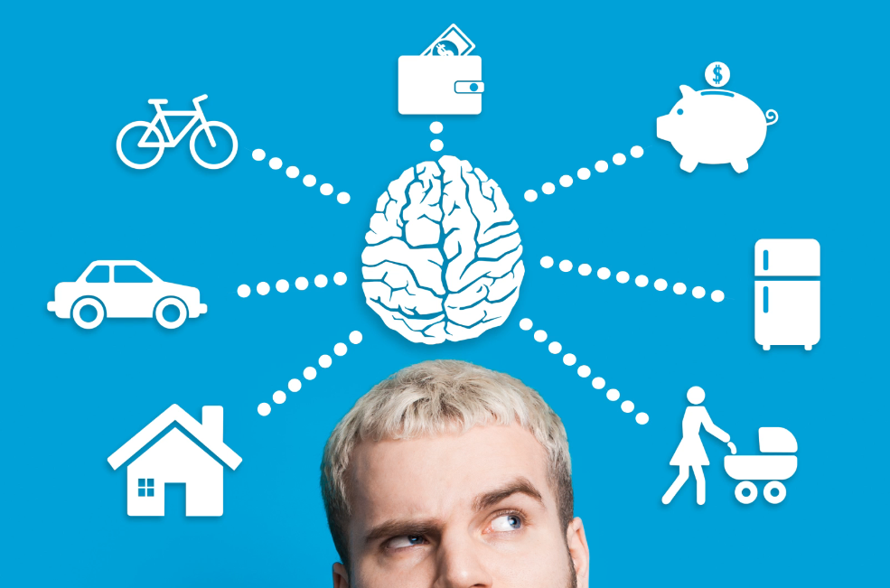

# UDY-SAPParaPrincipiantes

## Seccion 1: Introduccion al mundo SAP

### Video 1. Que es SAP?

Es una gran empresa que produce un gran software para gestionar empresas, en su mayoria tambien grandes empresas

* La empresa SAP produce software para gestionar empresas
* El software para gestionar empresas se llama ERP, abreviatura de planificacion de recursos empresariales.

Es posible que tengamos muchos otros proveedores de software ERP, pero definiticamente SAP es el lider en ese campo

Los sistemas ERP soportan principalmente finanzas, ventas, distribucion, recursos humanos.

SAP es una marca alemana y nombre de la empresa es una abreviatura de sistema

El nombre completo de la empresa es `SAP SE`, tiene su sede en alemania pero la gente simplemente le llamo SAP 

El producto mas popular de la empresa de SAP es ``SAP ERP``
* Que es un software empresarial para gestionar las operaciones comerciales y relaciones con los clientes
    * Este software conmunmente tambien se le llama SAP, pero no significa que sea el unico producto de la empresa, si no que ``SAP ERP es el mas popular``
* Tambien existe ``SAP CRM``
* Tambien existe ``SAP PLM``
* Tambien existe ``SAP BI``
* Etc

Si ponemos el contexto en relacion Coca Cola que es la empresa y produce la bebida Coca Cola 

Tenemos empresa SAP y producto SAP que es un software para administrar empresas

* Conclusion
    * SAP es una empresa alemana
    * SAP crea soluciones que ayudan a otras empresas para funcionar con mayor eficacia y tal Software se llama ``ERP``
    * SAP es lider en el merdado de software
    * SAP es realmente grande

El nacimiento de SAP se remonta a que habia 5 personas exempleados de IBM 

SAP es realmente grande a la altura de Microsoft, Google, etc

El 77% de los ingresos del mundo se relacionan con el sistema SAP

Ejemplo de algunas empresas que trabajan con SAP

### Video 2. Que son los sistemas ERP?

Cuando la gente habla de un software para gestionar empresas, siempre mencionan un sistema ERP.

ERP es un sistema para gestionar toda la empresa al igual que operar, el sistema administra su computadora personal.

Asi que tenemos un sistema para todo
* Finanzas
* Planificacion de la produccion
* Ventas y distribucion
* Gestion de materiales
* Recursos humanos
* Control
* Comercio Electronico
* Marketing

Todos esos puntos es ERP

Por lo tanto podemos decir que ERP es un sistema para administrar los recurso de las empresas sin embargo administrar los recursos es un poco abstracto

Imaginemos que tipo de recursos tenemos como ser humano
* Una casa
* Un carro
* Una bicicleta
* Tienes dinero en tu billetera
* Tienes dinero en el banco
* Tienes nevera y dentro tiene
    * Frutas
    * Maiz
    * Bebida    
    * Pizza

Pudes gestionar los recursos por tu cuenta, si tienes suficiente comida para el fin de semana, o deberia pagar un seguro de un coche, por ejemplo si sabes que te has comida todo el arroz o pan, compraras mas y ``lo gestionas sin ningun software``
Puede haber ocaciones en los que se contrate a una niñera para ayudar con los niños y tienes que pagarle mensualmente, planificar cuando tendra vacaciones y cuando puede venir a trabajar contigo, ``entonces lo administras sin ningun software`` tambien

Se puede decir que tienes tu sistema ERP pero en la cabeza, digamos que tu cerebro es un software para administrar todos tus recursos 

ERP es un sistema para gestionar toda la empresa, como tu cerebro gestiona toda tu vida

ERP integra todos los procesos de negocio teniendp un lugar en la empresa

Pero que significa en la practica?

Imaginemo que hemos creado un pequeño negocio.
* Por ejemplo, tienes unas flores en tu Jardin y empiezas a venderlas
* No tienes muchas ventas por lo que comienzas a utilizar papel para crear facturas
* Luego te modernizaste y comenzaste a usar Word para crear facturas y Excel para controlar toda la contabilidad
* Cada ves tienes mas ventas
* Algunas personas no estan pagando a tiempo, entonces tienes facturas sin pagar en lenguaje comercial, en lenguage comercial, cuentras por cobrar y tu excel se vuelve mas complejo
* Compras cosas para tu organizacion como sillas y escritorios de venta, cajas para flores, listones
* Asi que tienes factura de compra que deseas clasificar como un costo para reducir impuestos
* Tambien usas excel para eso, por lo tanto tu contabilidad sigue aumentando
* Empiezas a usar un programa de contabilidad simple
* Puedes atreverte a hacer facturas de venta, facturas de entrada de compra, puedes ver que facturas se pagaron o no
* Los impuestos de cada ves se calculan automaticamente
* Tu empresa esta creciendo, tu negocio va muy bien, tienes mas y mas pedidos
* Las flores ya no son suficientes para sastifacer la demanda de los clientes
* Por lo tanto decidiste comprar flores de otros Proveedores y venderlas
* Eso si hay que guardarlos en algun sitio y ya se lleno el sotano
* Alquilas un almacen
* Se debe registrar 
Min: 5:20

### Video 3. Las caracteristicas mas importantes del software ERP

## Seccion 2: El sistema de todo lo que necesitas saber sobre SAP

### Video 4. Evolucion del sistema de SAP
### Video 5. Arquitectura SAP - Capas
### Video 6. Como obtener acceso a SAP
### Video 7. Como iniciar sesion en SAP
### Video 8. Menu SAP, transacciones
### Video 9. Navegacion SAP
### Video 10. Donde estan nuestros modulos?
### Video 11. Favoritos
### Video 12. Datos maestros y de transaccion
### Video 13. Escructura organizativa
### Video 14. Configuracion SAP

## Seccion 3: Sistema SAP en la practica
### Video 15. Creacion de materiales
### Video 16. Precio de materiales
### Video 17. Movimiento de materiales
### Video 18. Creacion de clientes
### Video 19. Proceso Order to Cash - O2C
### Video 20. Consulta
### Video 21. Cotizacion
### Video 22. Ordenes de venta
### Video 23. Entrega de salida
### Video 24. Buen asunto
### Video 25. Factura
### Video 26. Gracias